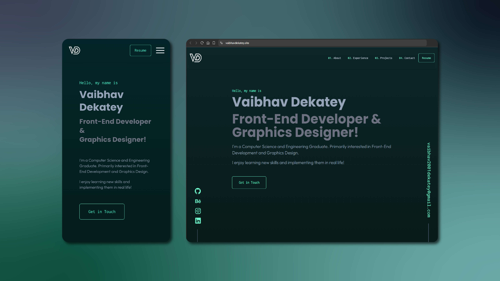

# Portfolio Website

Welcome to my portfolio website! This project showcases my skills, projects, and experiences in web development, graphic design, and more. It is built with **React.js** and styled with **Tailwind CSS**, ensuring a responsive and dynamic user experience.



---

## Features

- **Responsive Design:** Optimized for viewing on desktops, tablets, and mobile devices.
- **Dynamic Components:** Interactive sections for projects, skills, and contact details.
- **Modern Styling:** Tailwind CSS for fast and efficient styling.
- **Smooth Navigation:** Seamless navigation between different sections.
- **Showcasing Projects:** Highlighting some of my best works with detailed descriptions and links.

---

## Tech Stack

- **Frontend Framework:** React.js
- **Styling:** Tailwind CSS
- **Build Tool:** Vite (optional)
- **Version Control:** Git and GitHub

---

## Installation

Follow these steps to run the project locally:

1. **Clone the Repository:**

   ```bash
   git clone https://github.com/vaibhavdekatey/portfolio.git
   ```

2. **Navigate to the Project Directory:**

   ```bash
   cd portfolio
   ```

3. **Install Dependencies:**

   ```bash
   npm install
   ```

4. **Start the Development Server:**

   ```bash
   npm run dev
   ```

5. Open your browser and visit `http://localhost:5173` to view the website.

---

## Acknowledgements

Thank you for visiting my portfolio website. I hope you find it engaging and informative!
